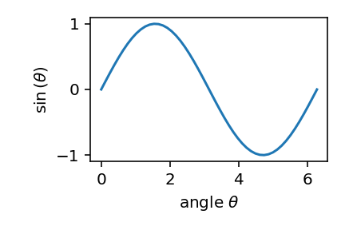

# 📽️ slides

Create stunning presentations using [markdown](https://www.markdownguide.org) powered by [reveal.js](https://revealjs.com).

[](https://github.com/tillahoffmann/slides/actions/workflows/main.yaml)
[](https://pypi.org/project/markdown-slides/)

---

This README is a slide deck. Run `pip install markdown-slides` from the command line to install the package. Then run `slides` to launch a presentation server and view the deck.

---

Here is a simple figure.



Note:

Speaker notes start with `Note:` on each slide and can be accessed by hitting the `S` code.

---

You can also [include equations](https://revealjs.com/math/#markdown) wrapped in backticks.

`\[\begin{aligned}
F(x)&=\int dx\, \cos(x)\\
&=\sin(x) + C.
\end{aligned}\]`

---

<div class="col">

Create columns using a `div` with `class="col"`. There must be an empty line after the `div` for embedded markdown to render.
</div>

<div class="col">

```markdown
<div class="col-6">

Content. Use `col-4` or
`col-6` to create 40% and
60% width columns,
respectively. Make sure the
numbers add up to 10 or
subsequent content may float.
</div>
```
</div>

---

Code can be included with [code fences](https://www.markdownguide.org/extended-syntax/#fenced-code-blocks).

```python
def add(a: int, b: int) -> int:
    """
    Add two integers.
    """
    return a + b
```

---

Reveal.js supports special syntax to set arbitrary HTML attributes on [slides](https://revealjs.com/markdown/#slide-attributes), such as this background gradient.

<!-- .slide: data-background-gradient="radial-gradient(white, #E5CAC9)" -->

```html
<!-- .slide: data-background-gradient="radial-gradient(#E5CAC9, #B55A5A)" -->
```

This also works for [elements](https://revealjs.com/markdown/#element-attributes):
- green bullet point <!-- .element: style="color: #4db848" -->

```markdown
- green bullet point <!-- .element: style="color: #4db848" -->
```

---

For labeled slides, we can link back to them. E.g., the [next one](#next-slide).

---

<!-- .slide: id="next-slide" -->

This is a slide labeled with the id `next-slide`.

```markdown
<!-- .slide: id="next-slide" -->
```

^^^

[Vertical slides](https://revealjs.com/vertical-slides/) can be used to logically group content. They are created using the `^^^` separator between slides.

---

[Jekyll-style frontmatter](https://jekyllrb.com/docs/front-matter/) can be used to configure the presentation. See [`slides/frontmatter.schema.yaml`](slides/frontmatter.schema.yaml) for details.

---

Visit the [reveal.js website](https://revealjs.com/markdown/) for further information.
